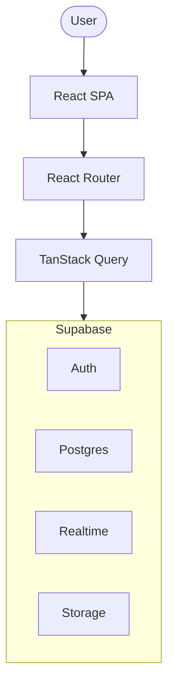
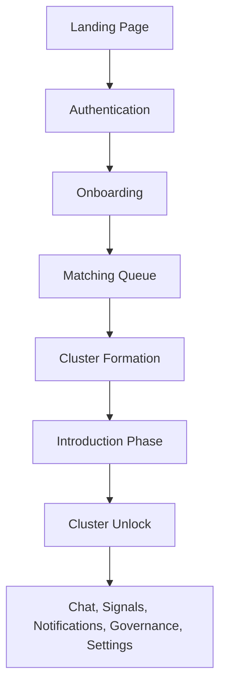
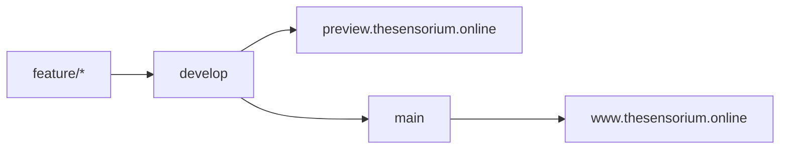

# Sensorium Architecture

This document gives a high-level overview of how Sensorium is organized. It is written for new contributors: reading it should take 10-15 minutes and leave you with a mental map you can use before diving into the code.

For the deeper implementation detail (exact libraries, config, schema internals, migration mechanics, and deployment), see [`TECHNICAL.md`](TECHNICAL.md). For what the product is and why, see [`PRD.md`](PRD.md). The recommended reading order is in the [README](../README.md#documentation) and the [docs index](README.md).

## 1. Architecture Overview

Sensorium is a React single-page application that talks to Supabase for everything server-side. The browser renders the UI and calls Supabase directly; there is no custom backend application server in between.

Each layer has a single, clear responsibility:

| Layer | Responsibility |
|---|---|
| **React SPA** | Renders the UI. Owns component tree, state, and styling. |
| **React Router** | Maps URLs to pages and enforces access via route guards (guest, authenticated, onboarded). |
| **TanStack Query** | Fetches and caches server state; keeps the UI in sync with Supabase without manual bookkeeping. |
| **Supabase Auth** | Email/password identity. The SPA holds only the public anon key; everything privileged runs server-side. |
| **Supabase Postgres** | The source of truth. All data lives here and is guarded by Row Level Security (RLS). |
| **Supabase Realtime** | Pushes live changes (chat messages, presence, notifications) to subscribed clients. |
| **Supabase Storage** | Private file buckets for chat images and avatars, served via short-lived signed URLs. |

## 2. Repository Structure

The repository is organized so the frontend and backend live side by side, with docs and tests close to what they describe.

| Path | Purpose |
|---|---|
| `src/` | All frontend source code. |
| `src/app/` | The app skeleton: router, providers, auth context, access guards, and page layouts. |
| `src/pages/` | One component per route/page, composed from shared and feature components. |
| `src/components/` | Reusable UI: avatars, modals, cards, pickers, navigation chrome. |
| `src/features/` | Domain logic: matching, cluster, introductions, signals, votes, notifications, moderation. One module per domain, with its hooks and tests. |
| `src/lib/` | Shared utilities: the typed Supabase client, moods, modes, theme, geo/country data, and helpers. |
| `supabase/migrations/` | The entire database schema as ordered SQL files (the single source of truth for the backend). |
| `docs/` | Product, design, and technical documentation. |
| `public/` | Static assets served as-is (favicons, logo). |
| `tests/integration/` | Backend integration suite that exercises RLS and RPC behavior against a local Supabase stack. |
| `e2e/` | End-to-end Playwright specs that drive the app through real browser flows. |
| `scripts/` | Development/ops helpers, notably the demo data seeder. |

Don't memorize the tree; this is just a map. Files live where their concern lives, and you can find most things by name.

## 3. Application Flow

The product is a journey. A user lands, authenticates, gets matched, and lands in a permanent cluster. Following one user end to end shows how the pieces connect:

- **Landing Page**: public marketing page with no auth required.
- **Authentication**: signup, login, email verification, and password reset.
- **Onboarding**: profile setup before the user can enter queues.
- **Matching Queue**: the user opts into up to six matching modes; each queues them separately.
- **Cluster Formation**: when a mode reaches eight ready people, a cluster is formed.
- **Introduction Phase**: a shared five-question intro must be completed within 72 hours before the room opens.
- **Cluster Unlock**: once unlocked, members get chat, moods/pulse, Signals, votes, and notifications.

The routing guards in `src/app/` enforce this order: guests can't reach onboarding, un-onboarded users can't reach the app, and cluster features require membership.

## 4. Frontend Architecture

The frontend is a feature-first React app built on a small set of opinionated tools.

- **React 19**: components and hooks. State is kept local and small; server state is pushed to TanStack Query.
- **React Router**: declarative routes in `src/app/router.tsx`, with layout components (`AppShell`, `PublicLayout`, `ClusterLayout`) and guard components that redirect based on auth/onboarding state.
- **TanStack Query**: every server read goes through a feature module in `src/features/`, which exposes hooks that wrap TanStack Query. Components call hooks; they never talk to Supabase directly.
- **Supabase client**: a single typed client instance in `src/lib/supabase.ts`, with a generated TypeScript type for the database.

Responsibilities are separated by layering:

- **Pages** compose features and components. They contain routing-specific logic only.
- **Feature modules** own one domain (e.g. matching). Each exposes data hooks, realtime subscriptions, and mutations. This is where business-facing frontend logic lives.
- **Components** are reusable and mostly presentational, driven by props and the hooks they're given.
- **Lib** holds pure utilities and cross-cutting concerns (theme, modes, moods, utils) with no page awareness.

This keeps components small and focused, prevents duplicated logic, and makes a feature findable by name.

## 5. Backend Architecture

There is no application server. Supabase provides every backend service, and the frontend talks to it directly using only the public anon key.

- **Authentication**: email/password. The anon key can initiate auth flows but nothing privileged.
- **PostgreSQL**: the database is the single source of truth. All tables, functions, policies, and scheduled jobs are defined in `supabase/migrations/`.
- **Row Level Security**: every table has RLS enabled. Users only ever see rows they're allowed to; the frontend never bypasses this.
- **RPC Functions**: privileged operations are exposed as Postgres functions (often `security definer`) and called via `.rpc()`. This is how the frontend performs actions it isn't allowed to do with direct row writes.
- **Storage**: private buckets for chat images and avatars. Files are served through short-lived signed URLs, never through public object URLs.
- **Realtime**: the SPA subscribes to database changes (chat, presence, notifications) and reacts live.
- **Scheduled Jobs**: pg_cron runs database functions on a schedule (e.g. expiring stale signals, rebalancing membership).

The important mental model: **security lives in the database, not in the client**. The browser is untrusted; RLS and RPC functions are the enforcement point.

## 6. Database Philosophy

The database is designed deliberately and treated as part of the product, not an afterthought.

- **Database-first design**: schema, permissions, and behavior are defined in SQL and versioned with the app.
- **Every change is a migration**: the schema evolves only through new ordered files in `supabase/migrations/`.
- **Never edit an applied migration**: once a migration has run, it's immutable; changes come as new migrations on top.
- **RLS on every table**: there is no unprotected table. Access is granted by policy, per row.
- **Business logic lives in SQL/RPC where appropriate**: operations that cross trust boundaries (matching, votes, replacement, account deletion) are implemented as database functions guarded by grants, rather than trusting client-side checks.

This philosophy is why backend changes tend to be migration + integration-test shaped: the integration suite exercises RLS and RPC behavior directly.

## 7. Development Workflow

Sensorium uses a staging-driven Git workflow with two long-lived branches.

- **`feature/*`**: short-lived branches cut from `develop`, one per unit of work. Each gets its own Vercel Preview deployment against the staging Supabase project.
- **`develop`**: the shared staging branch. External contributors land work via pull requests; core maintainers may commit directly. It auto-deploys to **preview.thesensorium.online**.
- **`main`**: production. Releases are always a pull request from `develop` into `main`. Direct pushes are prohibited; it deploys to **www.thesensorium.online**.

Contributors never branch from `main`, never open PRs directly into `main`, and never push directly to `main`. See [`CONTRIBUTING.md`](../CONTRIBUTING.md) for the full contributor workflow and [`TECHNICAL.md`](TECHNICAL.md#ci-and-deployment) for the pipelines in detail.

## 8. Deployment Architecture

A single Vercel project serves the app with two environments, backed by two Supabase projects (one per environment, fully isolated).

| Environment | Branch | Vercel | Supabase |
|---|---|---|---|
| Production | `main` | Production deployment | Production project |
| Preview | `develop` | Preview deployment | Staging project |
| Feature previews | `feature/*` | Individual Preview deployments | Staging project |

Production and staging are always isolated: different Vercel environments, different Supabase projects, separate credentials. Feature branches share the staging Supabase project but get their own frontend preview.

## 9. CI/CD Overview

The pipelines validate every branch and release changes in a controlled order. Three GitHub Actions workflows handle it; for the exact steps and secrets, see [`TECHNICAL.md`](TECHNICAL.md#ci-and-deployment).

- **CI workflow**: runs on push/PR to `main` and `develop`, and on push to `feature/*`, `fix/*`, and `docs/*`. It runs lint, unit tests with a coverage gate, the production build, applies migrations to a throwaway local Supabase stack, runs the integration suite, and runs the blocking Playwright E2E suite.
- **Staging migration workflow**: on merge/push to `develop`, applies pending migrations to the staging Supabase project. Feature branches never apply migrations directly; migration SQL is applied only once the PR lands on `develop`.
- **Production migration workflow**: on merge/push to `main`, applies the same pending migrations to the production Supabase project.

The order matters: migrations land on staging first, are tested there, and only reach production through a `main` release.

## 10. Design Principles

These are the principles that shape every part of the codebase. If you're unsure how to build something, let these guide you.

- **Feature-based organization**: code lives near the feature it belongs to (`src/features/`), so a domain is findable and self-contained.
- **Type safety**: strict TypeScript end to end, including a typed database client.
- **Small, focused components**: components do one thing and are composed rather than grown.
- **No duplicated logic**: shared behavior lives in lib or feature modules and is reused, not copied.
- **Composition over inheritance**: React components and hooks are composed.
- **Single source of truth for business logic**: product behavior lives in one authoritative place, whether that's a feature module or a database function.
- **Security through Row Level Security**: the database is the enforcement point; the client is never trusted.
- **Production and staging are always isolated**: separate environments and databases, so staging changes never leak into production.
- **Documentation is part of the product**: the docs (`PRD.md`, `DESIGN.md`, `TECHNICAL.md`, this file) are kept current as the single source of truth alongside the code.
